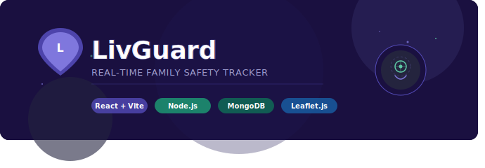

<div align="center">



<br/><br/>

[](https://liv-guard.vercel.app)
[](https://react.dev)
[](https://nodejs.org)
[](https://mongodb.com)
[](https://vercel.com)
[](https://render.com)
[](LICENSE)

</div>

---

## 📌 Table of Contents

- [Problem Statement](#-problem-statement)
- [What is LivGuard?](#-what-is-livguard)
- [Live Demo](#-live-demo)
- [Features](#-features)
- [How It Works](#-how-it-works)
- [Tech Stack](#-tech-stack)
- [Deployment Architecture](#-deployment-architecture)
- [Getting Started](#-getting-started)
- [Usage Guide](#-usage-guide)
- [Demo Credentials](#-demo-credentials)
- [Project Structure](#-project-structure)
- [Future Improvements](#-future-improvements)
- [Author](#-author)

---

## ❗ Problem Statement

In today's fast-paced world, families are often spread across cities, campuses, and workplaces. Parents worry about children commuting late at night. Elderly family members may wander or need assistance. Friends want to coordinate meetups safely.

Existing solutions either:
- Require expensive hardware (GPS devices)
- Lock features behind paywalls
- Compromise user privacy with always-on tracking
- Lack real-time responsiveness

**LivGuard solves this** by providing a lightweight, browser-based, consent-first location sharing system — no app install required, no subscription fees, and no hidden tracking. It works anywhere in the world, on any device with a browser.

> *Your family's safety shouldn't depend on a monthly subscription.*

---

## 🌍 What is LivGuard?

**LivGuard** is a full-stack, real-time web application that enables trusted family members to share and view live locations securely through an interactive map interface.

Built with a modern **React + Node.js + MongoDB** stack and deployed on cloud platforms, LivGuard demonstrates production-grade engineering: secure JWT-based authentication, RESTful API design, real-time geolocation, and a responsive map UI — all accessible from any browser, anywhere in the world.

---

## 🔗 Live Demo

| Service | Details |
| :--- | :--- |
| 🖥️ **Frontend (Live App)** | [https://liv-guard.vercel.app](https://liv-guard.vercel.app) |
| ⚙️ **Backend** | `https://livguard.onrender.com` (REST API — not a webpage) |
| ☁️ **Frontend Hosting** | Vercel |
| 🖥️ **Backend Hosting** | Render |

> ⚠️ **Note:** The backend runs as a REST API server — it is not meant to be opened in a browser. The frontend at the link above is the full usable app.

---

## ✨ Features



| Icon | Feature | Description |
| :---: | :--- | :--- |
| 📍 | **Live Location Tracking** | Tracks real-time GPS coordinates using the browser Geolocation API |
| 🔐 | **OTP-Based Authentication** | Secure login flow using a one-time password with JWT session tokens |
| 👨‍👩‍👧 | **Family Member System** | Add and manage trusted family members to share location with |
| 🗺️ | **Interactive Map UI** | Zoomable Leaflet.js map with live location pins and labels |
| 🔄 | **Real-Time Updates** | Location refreshes continuously while the session is active |
| 🌐 | **Globally Accessible** | Fully deployed — works from any device, any browser, anywhere |
| 📱 | **Responsive Design** | Optimized for both desktop and mobile browsers |
| 🔒 | **Consent-First Model** | Location shared only when user explicitly grants browser permission |

---


## ⚙️ How It Works

```
┌──────────────────────────────────────────────────────────────┐
│                         USER FLOW                            │
│                                                              │
│  1. User visits LivGuard → enters phone number              │
│              │                                               │
│              ▼                                               │
│  2. OTP is generated & validated (demo OTP: 722303)         │
│              │                                               │
│              ▼                                               │
│  3. JWT token issued → user session begins                  │
│              │                                               │
│              ▼                                               │
│  4. User allows browser location permission                 │
│              │                                               │
│              ▼                                               │
│  5. Geolocation API captures lat/lng coordinates            │
│              │                                               │
│              ▼                                               │
│  6. Coordinates sent to Express backend via REST API        │
│              │                                               │
│              ▼                                               │
│  7. MongoDB stores/updates location document                │
│              │                                               │
│              ▼                                               │
│  8. Family members query API → see pins on Leaflet map      │
└──────────────────────────────────────────────────────────────┘
```
### 🔑 Authentication Flow

1. User enters their registered phone number
2. OTP is issued (in production: sent via SMS; demo: fixed OTP `722303`)
3. OTP is verified server-side → JWT access token returned
4. All subsequent API calls include the Bearer token in headers
5. Protected routes validate the JWT on every request

### 📡 Location Sharing Flow

1. Browser's `navigator.geolocation.watchPosition()` continuously polls coordinates
2. On each update, a `PATCH /api/location` request is sent to the backend
3. Backend updates the user's location document in MongoDB
4. Family members' dashboards periodically call `GET /api/family/locations`
5. Leaflet.js re-renders map markers at updated coordinates

---

## 🧰 Tech Stack

### 🎨 Frontend

| Technology | Purpose |
| :--- | :--- |
| **React (Vite)** | Component-based UI with fast HMR development |
| **JavaScript (ES6+)** | Application logic and async API communication |
| **Leaflet.js** | Interactive, mobile-friendly maps with custom markers |
| **HTML5 / CSS3** | Semantic markup and responsive styling |
| **Axios** | RESTful communication with the backend |

### 🔧 Backend

| Technology | Purpose |
| :--- | :--- |
| **Node.js** | JavaScript runtime for server-side execution |
| **Express.js** | Lightweight REST API framework |
| **JWT (jsonwebtoken)** | Stateless session authentication |
| **CORS / dotenv** | Cross-origin config and environment management |

### 🗄️ Database

| Technology | Purpose |
| :--- | :--- |
| **MongoDB** | NoSQL document store for users and locations |
| **Mongoose** | Schema modeling and query abstraction |
| **MongoDB Compass** | Local DB management and visualization |

### ☁️ Deployment & Tools

| Service | Role |
| :--- | :--- |
| **Vercel** | Frontend hosting with CI/CD from Git |
| **Render** | Backend Node.js server hosting |
| **MongoDB Atlas** | Cloud-hosted MongoDB cluster |
| **Git & GitHub** | Version control and source code management |

### 🔩 Other Concepts Used

- Geolocation API (Browser GPS)
- Real-time data handling
- CORS handling
- Environment variables (.env)
- REST API Architecture

---

## 🏗️ Deployment Architecture



## 🏗️ Deployment Architecture

```
          ┌──────────────────────────┐
          │        END USER          │
          │   (Browser / Mobile)     │
          └────────────┬─────────────┘
                       │ HTTPS
          ┌────────────▼─────────────┐
          │         VERCEL           │
          │   React (Vite) Frontend  │
          │   liv-guard.vercel.app   │
          └────────────┬─────────────┘
                       │ REST API (HTTPS)
          ┌────────────▼─────────────┐
          │          RENDER          │
          │   Node.js + Express API  │
          │   livguard.onrender.com  │
          └────────────┬─────────────┘
                       │ Mongoose ODM
          ┌────────────▼─────────────┐
          │      MONGODB ATLAS       │
          │  Cloud Database Cluster  │
          └──────────────────────────┘
```
- **Frontend** is statically built and served via Vercel's global CDN edge network
- **Backend** runs as a persistent Node.js process on Render's cloud infrastructure
- **Database** is a managed MongoDB Atlas cluster with connection pooling via Mongoose
- All communication uses **HTTPS** with **JWT Bearer tokens** for security

---

## 🚀 Getting Started

### Prerequisites

Make sure you have the following installed:

- [Node.js](https://nodejs.org/) `v18+`
- [npm](https://npmjs.com/) or [yarn](https://yarnpkg.com/)
- [MongoDB Atlas](https://www.mongodb.com/atlas) account (or local MongoDB)
- [Git](https://git-scm.com/)

### 1️⃣ Clone the Repository

```bash
git clone https://github.com/Ravishankar0108/livguard.git
cd livguard
```

### 2️⃣ Backend Setup

```bash
cd backend
npm install
cp .env.example .env
```

Configure your `.env` file:

```env
PORT=5000
MONGO_URI=your_mongodb_atlas_connection_string
JWT_SECRET=your_super_secret_jwt_key
DEMO_OTP=722303
```

```bash
npm run dev
```

> Backend will run at `http://localhost:5000`

### 3️⃣ Frontend Setup

```bash
cd ../frontend
npm install
cp .env.example .env
```

Configure your `.env` file:

```env
VITE_API_BASE_URL=http://localhost:5000
```

```bash
npm run dev
```

> Frontend will run at `http://localhost:5173`

---

## 📖 Usage Guide

1. **Open the app** at [https://liv-guard.vercel.app](https://liv-guard.vercel.app)
2. **Register / Login** using your phone number
3. **Enter the OTP** when prompted — use `722303` for demo
4. **Allow location permission** when the browser asks
5. **Your live location** will appear as a pin on the interactive map
6. **Add family members** using their registered phone numbers
7. **View their locations** as real-time pins on the shared map
8. **Keep the browser tab open** — location updates as long as the session is active

> 📌 **Tip:** Open the app on two different devices or browsers to see real-time family tracking in action!

---

## 🔑 Demo Credentials

| Field | Value |
| :--- | :--- |
| 📱 Phone Number | Any number (demo mode) |
| 🔢 OTP | `722303` |
| 🔐 Auth | JWT token (auto-managed by app) |

> ⚠️ **Security Notice:** The fixed OTP `722303` is for **demo purposes only**. In production, OTPs would be randomly generated, time-limited, and delivered via SMS (e.g., Twilio / AWS SNS).

---


## 📁 Project Structure

```
livguard/
│
├── frontend/                  # React (Vite) Application
│   ├── public/
│   ├── src/
│   │   ├── components/        # Reusable UI components
│   │   │   ├── Map.jsx        # Leaflet map component
│   │   │   ├── Login.jsx      # OTP login flow
│   │   │   └── Dashboard.jsx  # Family tracking dashboard
│   │   ├── api/               # API service functions
│   │   ├── App.jsx
│   │   └── main.jsx
│   ├── .env.example
│   └── package.json
│
├── backend/                   # Node.js + Express API
│   ├── controllers/
│   │   ├── authController.js
│   │   └── locationController.js
│   ├── middleware/
│   │   └── authMiddleware.js
│   ├── models/
│   │   ├── User.js
│   │   └── Location.js
│   ├── routes/
│   │   ├── authRoutes.js
│   │   └── locationRoutes.js
│   ├── .env.example
│   ├── server.js
│   └── package.json
│
└── README.md
```

## 🔮 Future Improvements

| Priority | Feature | Description |
| :---: | :--- | :--- |
| 🔴 High | **Real OTP via SMS** | Integrate Twilio / AWS SNS for secure, time-limited OTP delivery |
| 🔴 High | **WebSocket / Socket.IO** | Replace polling with true real-time push updates |
| 🟠 Medium | **Push Notifications** | Alert family members when someone arrives or leaves a location |
| 🟠 Medium | **Geo-fencing** | Define safe zones and receive alerts when boundaries are crossed |
| 🟠 Medium | **Location History** | Store and replay location trails with timestamps |
| 🟡 Low | **PWA Support** | Make LivGuard installable as a Progressive Web App |
| 🟡 Low | **Dark / Light Mode** | User-selectable theme with persistence |
| 🟡 Low | **Multiple Family Groups** | Support for creating and managing multiple sharing circles |
| 🔵 Future | **Native Mobile App** | React Native version for background location tracking |

---

## 👤 Author

<div align="center">

**Built with 💙 by Ravi Shankar Shukla**

[](https://github.com/Ravishankar0108)
[](https://linkedin.com/in/yourprofile)
[](https://yourportfolio.com)

</div>

---

## 📄 License

This project is licensed under the **MIT License** — see the [LICENSE](LICENSE) file for details.

---

<div align="center">

**⭐ If you found this project useful, please give it a star!**


</div>


